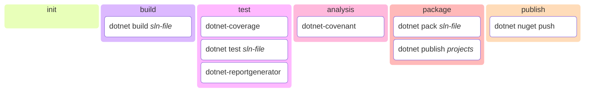

# ZeroFailed.Build.DotNet

[](https://github.com/zerofailed/ZeroFailed.Build.DotNet/actions/workflows/build.yml)
[](https://github.com/zerofailed/ZeroFailed.Build.DotNet/releases)
[](https://www.powershellgallery.com/packages/ZeroFailed.Build.DotNet)
[](https://github.com/zerofailed/ZeroFailed.Build.DotNet/blob/main/LICENSE)

A [ZeroFailed](https://github.com/zerofailed/ZeroFailed) extension containing features that support build processes for .NET projects.

## Overview

| Component Type | Included | Notes                                                                                                                                                         |
| -------------- | -------- | ------------------------------------------------------------------------------------------------------------------------------------------------------------- |
| Tasks          | yes      |                                                                                                                                                               |
| Functions      | yes      |                                                                                                                                                               |
| Processes      | no       | Designed to be compatible with the default process provided by the [ZeroFailed.Build.Common](https://github.com/zerofailed/ZeroFailed.Build.Common) extension |

For more information about the different component types, please refer to the [ZeroFailed documentation](https://github.com/zerofailed/ZeroFailed/blob/main/README.md#extensions).

This extension consists of the following feature groups:

- Compilation
- Testing
- SBOM generation
- NuGet & Application Packaging
- NuGet Publishing

The diagram below shows the discrete features and when they run as part of the default process provided by [ZeroFailed.Build.Common](https://github.com/zerofailed/ZeroFailed.Build.Common).



## Pre-Requisites

Using this extension requires the following components to be installed:

- [.NET SDK](https://dotnet.microsoft.com/en-us/download)
- [GitHub CLI](https://cli.github.com/)

## Dependencies

The following ZeroFailed extensions will be installed when using this extension.

| Extension                                                                        | Reference Type | Version |
| -------------------------------------------------------------------------------- | -------------- | ------- |
| [ZeroFailed.Build.Common](https://github.com/zerofailed/ZeroFailed.Build.Common) | git            | `main`  |

## Getting Started

If you are starting something new and don't yet have a ZeroFailed process setup, then follow the steps here to bootstrap your new project.

Once you have the above setup (or it you already have that), then simply add the following to your list of required extensions (e.g. in `config.ps1`):

```powershell
$zerofailedExtensions = @(
    ...
    # References the extension from its GitHub repository. If not already installed, use latest version from 'main' will be downloaded.
    @{
        Name = "ZeroFailed.Build.DotNet"
        GitRepository = "https://github.com/zerofailed/ZeroFailed.Build.DotNet"
        GitRef = "main"     # replace this with a Git Tag or SHA reference if want to pin to a specific version
    }

    # Alternatively, reference the extension from the PowerShell Gallery.
    @{
        Name = "ZeroFailed.Build.DotNet"
        Version = ""   # if no version is specified, the latest stable release will be used
    }
)
```

To use the extension to build an existing .NET solution, simply add the `SolutionToBuild` property with the path to your `.sln` file.

```powershell
# Load the tasks and process
. ZeroFailed.tasks -ZfPath $here/.zf

...

$SolutionToBuild = "<path-to-sln-file>"

...

# Customise the build process
task . FullBuild
```

## Usage

For an end-to-end example of using this extension to build a .NET project, please take a look at [this sample repo](https://github.com/zerofailed/ZeroFailed.Sample.Build.DotNet).

